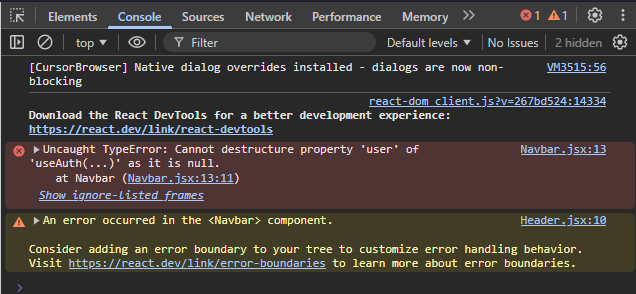

# Diplomatura en Profesional Full-Stack Developer

## Curso de Desarrollo en ReactJS - Profesor: Gabriel Alberini

### Modulo 3 - Integración de base de datos

### Unidad 3 - React avanzado

#### Tarea 3 - Mi app con Contexto Global

#### Tarea 3 - Objetivo:

Utilizar **Context API** para compartir y consumir infomación global en una aplicación React,
evitando el _prop drilling_ y aplicando buenas prácticas.


### Como ejecutar la tarea:

1. Clonar el repositorio:

```bash
git clone https://github.com/Diplomatura-Full-Stack-Developer/ReactJS-M3-T2.git

```

2. Instalar las dependencias:

```bash
npm install
```

3. Crear un archivo `.env` copia de `.env.template` en la raíz del proyecto.

```bash
cp .env.template .env
```

4. Agregar las variables de entorno en el archivo `.env`:

```bash
VITE_FIREBASE_API_KEY=
VITE_FIREBASE_AUTH_DOMAIN=
VITE_FIREBASE_PROJECT_ID=
VITE_FIREBASE_STORAGE_BUCKET=
VITE_FIREBASE_MESSAGING_SENDER_ID=
VITE_FIREBASE_APP_ID=
VITE_FIREBASE_MEASUREMENT_ID=
```

5. Ejecutar el comando: firebase deploy --only firestore:rules para poder acceder a la base de datos de Firebase (si es necesario).

```bash
firebase deploy --only firestore:rules
```

6. En la terminal del editor o powershell, ejecutar el comando: npm run dev para iniciar el servidor de desarrollo.

```bash
npm run dev
```

7. En el navegador, acceder a la URL: http://localhost:5173 para ver la aplicación.

8. Ejecutar desde la consola de DevTools de Chrome el comando:

```js
await seedProducts();
```
para crear los productos de prueba en la base de datos de Firestore.
Si la colección no existe, se crea automáticamente y se agregan los productos de prueba.


**Nota**: No es necesario hacer el _deploy_ para poder acceder a la base de datos de Firebase.

### Consideraciones de la aplicación:

Se utiliza como base la aplicación de la tarea 2 del módulo 3. 


### Consideraciones sobre el uso de Context API:

1. Se crea un authContext para compartir la información de autenticación globalmente en la aplicación.

2. Se consume en los siguientes componentes:
   
    - En el Navbar para mostrar el botón de cierre de sesión o inicio de sesión, de acuerdo al estado de autenticación.
    - En el Navbar para agregar al menú de navegación el link al dashboard de administración solo si el usuario está autenticado.
    - En el DashboardRouter para proteger las rutas si el usuario no está autenticado.
    - En el ProtectedRoutes para enviar mensaje a la pantalla solicitando el inicio de sesión si el usuario no está autenticado.

3. En los ejemplos se utiliza el hook **useAuth** para obtener el estado de autenticación y el usuario autenticado.

4. Una mejora a implementar es crear una colección en Firebase **users**, para agregar el rol de usuario (admin, user) y algún dato adicional como por ejemplo el nombre. No se implementó en esta tarea porque no se especificó en la consigna.

5. Si se elimina el provider del contexto como se muestra en el código adjunto. 


```jsx
import './styles.css';
import { AppRouter } from '../src/router/AppRouter';
// import { AuthProvider } from './auth/provider/AuthProvider';


export const App = () => {
  return (
    // <AuthProvider>
      <AppRouter />
    // </AuthProvider>
  );
};

```
Se rompe la aplicación con un mensaje de error en la consola del navegador:



**Nota**: No se entiende bien en la consigna que es lo que se debe remover, para que dé _undefined_. 


### Consideraciones del diseño UI:

Se mantiene la aplicación de la técnica de _mobile first_.

### Recursos utilizados en la tarea:

- Firebase (https://firebase.google.com/)
- React (https://react.dev/)
- React Router (https://reactrouter.com/home)
- React Icons (https://react-icons.github.io/react-icons/)
- SweetAlert2 (https://sweetalert2.github.io/)
- Shadcn UI (https://ui.shadcn.com/)

### Alumno: Rubén Seco

### Comisión: 181752
