# Diplomatura en Profesional Full-Stack Developer

## Curso de Desarrollo en ReactJS - Profesor: Gabriel Alberini

### Modulo 3 - Integración de base de datos

### Unidad 2 - Firebase - Parte II

#### Tarea 2 - Mi primer CRUD con Firestore

#### Tarea 2 - Objetivo:

Aplicar las operaciones CRUD (**Create, Read, Update, Delete**) con Firestore,
comprendiendo cuándo y cómo usar addDoc(), setDoc(), updateDoc() y deleteDoc(),
así como el uso de lecturas en tiempo real.

### Como ejecutar la tarea:

1. Clonar el repositorio:

```bash
git clone https://github.com/Diplomatura-Full-Stack-Developer/ReactJS-M3-T2.git

```

2. Instalar las dependencias:

```bash
npm install
```

3. Crear un archivo `.env` copia de `.env.template` en la raíz del proyecto.

```bash
cp .env.template .env
```

4. Agregar las variables de entorno en el archivo `.env`:

```bash
VITE_FIREBASE_API_KEY=
VITE_FIREBASE_AUTH_DOMAIN=
VITE_FIREBASE_PROJECT_ID=
VITE_FIREBASE_STORAGE_BUCKET=
VITE_FIREBASE_MESSAGING_SENDER_ID=
VITE_FIREBASE_APP_ID=
VITE_FIREBASE_MEASUREMENT_ID=
```

5. Ejecutar el comando: firebase deploy --only firestore:rules para poder acceder a la base de datos de Firebase.

```bash
firebase deploy --only firestore:rules
```

**Nota**: No es necesario hacer el _deploy_ para poder acceder a la base de datos de Firebase.

### Configuración de Firebase:

Dentro de la aplicación se crea la carpeta `firebase` en la carpeta `src` del proyecto y se agregan el archivo de configuración de Firebase.

`config.js`

```js
import { initializeApp } from 'firebase/app';
import { getAnalytics } from 'firebase/analytics';
import { getFirestore } from 'firebase/firestore';
import { getAuth } from 'firebase/auth';

const firebaseConfig = {
  apiKey: import.meta.env.VITE_FIREBASE_API_KEY,
  authDomain: import.meta.env.VITE_FIREBASE_AUTH_DOMAIN,
  projectId: import.meta.env.VITE_FIREBASE_PROJECT_ID,
  storageBucket: import.meta.env.VITE_FIREBASE_STORAGE_BUCKET,
  messagingSenderId: import.meta.env.VITE_FIREBASE_MESSAGING_SENDER_ID,
  appId: import.meta.env.VITE_FIREBASE_APP_ID,
  measurementId: import.meta.env.VITE_FIREBASE_MEASUREMENT_ID,
};

export const app = initializeApp(firebaseConfig);
export const analytics = getAnalytics(app);
export const db = getFirestore(app);
export const auth = getAuth();
```

### Consideraciones generales de la tarea:

Se utiliza como base de partida la tarea 1 del modulo 3 (Firebase - Parte I).

### Consideraciones sobre la base de datos:

Ejecutar desde la consola de DevTools de Chrome el comando:

```js
await seedProducts();
```

para crear los productos de prueba en la base de datos de Firestore.
Si la colección no existe, se crea automáticamente y se agregan los productos de prueba.

### Consideraciones del _**update**_ de un producto:

Se habilitan para modificar solamente los campos que son editables: precio, stock y oferta en cuotas.
Modificar otros campos, implicaría crear un producto distinto sobre uno existente.

### Consideraciones del _**delete**_ de un producto:

El producto se marca como borrado (soft delete) para cumplir con la consigna de uso de **setDoc()** con **{ merge: true }**.
El producto se puede eliminar permanentemente desde la sección de productos borrados para cumplir con la consigna de uso de **deleteDoc()**.

### Captura de pantallas de la aplicación:

Las capturas se realizan de las pantallas para dispositivos móviles,
para mostrar que se realizó la tarea aplicando la técnica de **mobile first**.

<table>
  <thead>
    <tr align="center">
      <th style="font-size: 12px;">Inicio</th>
      <th style="font-size: 12px;">Panel de administración</th>
      <th style="font-size: 12px;">Login</th>
      <th style="font-size: 12px;">Register</th>
    </tr>
  </thead>
  <tbody>
  <tr>
    <td width="25%">
      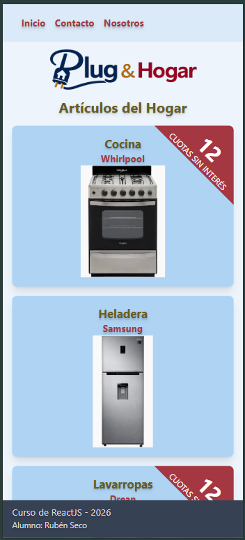
    </td>
    <td width="25%">
      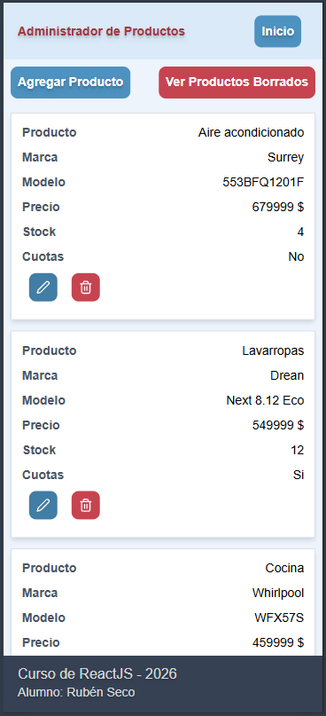
    </td>
    <td width="25%">
      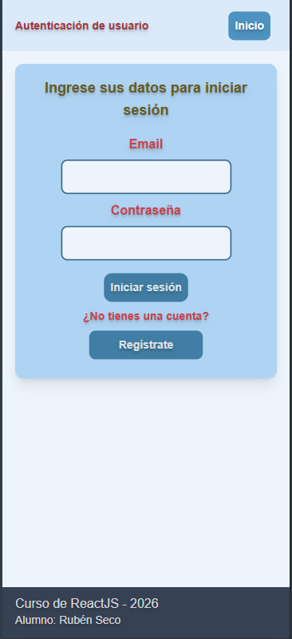
    </td>
    <td width="25%">
      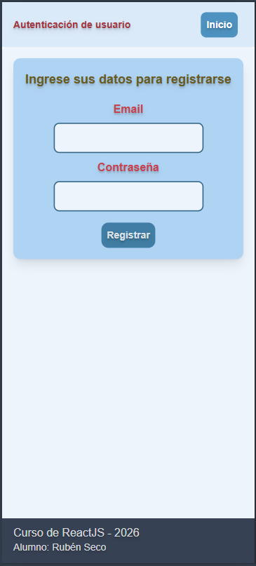
    </td>
  </tr>
  </tbody>
</table>

<table>
  <thead>
    <tr align="center">
      <th style="font-size: 12px;">Login exitoso</th>
      <th style="font-size: 12px;">Login fallido</th>
      <th style="font-size: 12px;">Register exitoso</th>
      <th style="font-size: 12px;">Register fallido</th>
    </tr>
  </thead>
  <tbody>
  <tr>
    <td width="25%">
      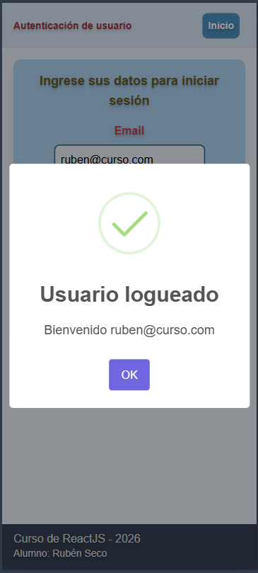
    </td>
    <td width="25%">
      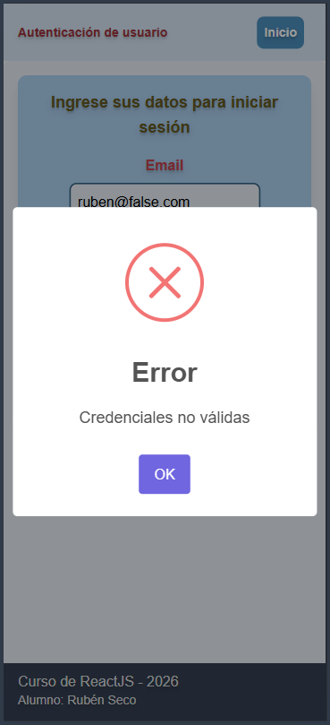
    </td>
    <td width="25%">
      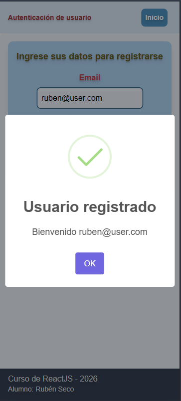
    </td>
    <td width="25%">
      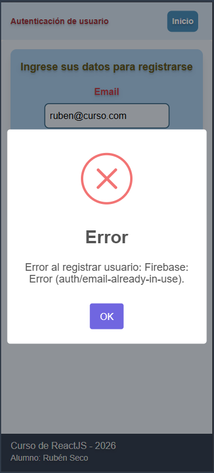
    </td>
  </tr>
  </tbody>
</table>
<table>
  <thead>
    <tr align="center">
      <th style="font-size: 12px;">Update</th>
      <th style="font-size: 12px;">Soft delete</th>
      <th style="font-size: 12px;">Hard delete</th>
      <th style="font-size: 12px;">Add product</th>
    </tr>
  </thead>
  <tbody>
  <tr>
    <td width="25%">
      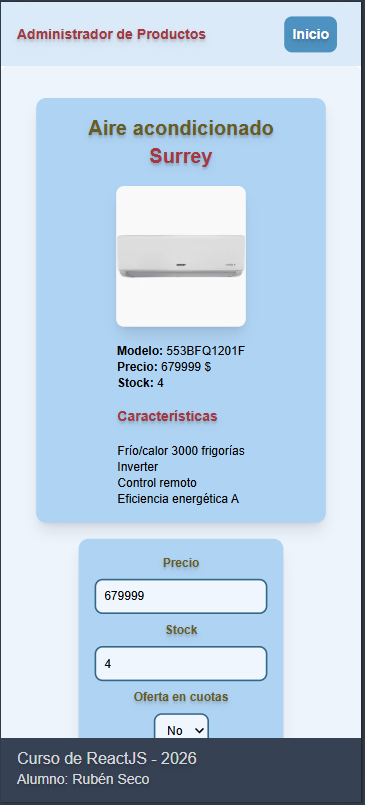
    </td>
    <td width="25%">
      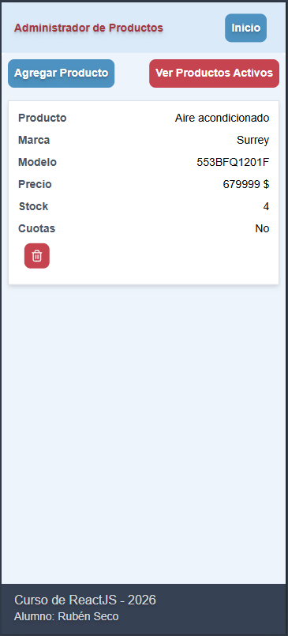
    </td>
    <td width="25%">
      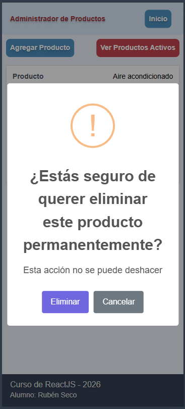
    </td>
    <td width="25%">
      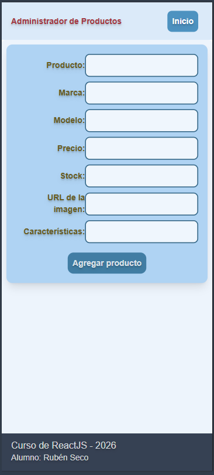
    </td>
  </tr>
  </tbody>
</table>

### Recursos utilizados en la tarea:

- Firebase (https://firebase.google.com/)
- React (https://react.dev/)
- React Router (https://reactrouter.com/home)
- React Icons (https://react-icons.github.io/react-icons/)
- SweetAlert2 (https://sweetalert2.github.io/)
- Shadcn UI (https://ui.shadcn.com/)

### Alumno: Rubén Seco

### Comisión: 181752
